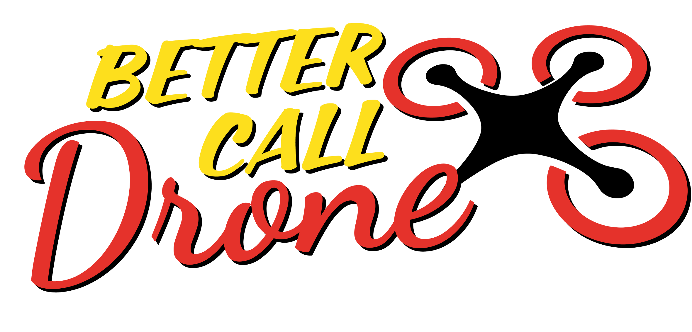

<a id="readme-top"></a>

<!-- PROJECT LOGO -->
<br />
<div align="center">
  <a href="https://github.com/BetterCallDrone">
    
  </a>

  <i>
    <p align="center" style="font-size:14px; ">
      Your new flight partner
  </p></i>
</div>

<!-- ABOUT THE PROJECT -->

## About The Project

Welcome to our repository! Our drone emphasizes **minimalism**, **efficiency**, and **speed** to provide a seamless and effective user experience. Our solution ensures you have the tools you need without unnecessary complexity.

### Key Features

- **Minimal Design**: Clean and straightforward architecture makes it easy to understand, navigate, and extend.
- **High Efficiency**: Optimized codebase ensures quick performance and resource management, allowing you to focus on what matters most.
- **Fast Setup**: Get started in no time with the configuration process.
- **100% Code Coverage**: Comprehensive testing guarantees that every part of the code is thoroughly tested, ensuring reliability and robustness.
- **All Tests Pass**: Rigorous testing procedures mean that all tests pass consistently, providing confidence in the project's stability and functionality.

```sh
Running tests\commands_tests.rs

running 11 tests
test commands_tests::test_remove_non_existing_sender ... ok
test commands_tests::test_crash_flood_response ... ok
test commands_tests::test_crash_ack ... ok
test commands_tests::test_add_existing_sender ... ok
test commands_tests::test_add_sender ... ok
test commands_tests::test_crash_nack ... ok
test commands_tests::test_set_pdr ... ok
test commands_tests::test_set_invalid_pdr ... ok
test commands_tests::test_crash_message ... ok
test commands_tests::test_remove_sender ... ok
test commands_tests::test_crash_flood_request ... ok

test result: ok. 11 passed; 0 failed; 0 ignored; 0 measured; 0 filtered out; finished in 0.40s

     Running tests\flood_tests.rs

running 3 tests
test flood_tests::test_flood_2branch ... ok
test flood_tests::test_flood_straight ... ok
test flood_tests::test_flood_double_chain ... ok

test result: ok. 3 passed; 0 failed; 0 ignored; 0 measured; 0 filtered out; finished in 2.08s

     Running tests\nack_tests.rs

running 7 tests
test nack_tests::test_ack_to_sc ... ok
test nack_tests::test_nack_to_sc ... ok
test nack_tests::test_error_in_routing ... ok
test nack_tests::test_destination_is_drone ... ok
test nack_tests::test_unexpected_recipient ... ok
test nack_tests::test_flood_response_to_sc ... ok
test nack_tests::test_dropped ... ok

test result: ok. 7 passed; 0 failed; 0 ignored; 0 measured; 0 filtered out; finished in 0.01s

     Running tests\wg2024_repo_tests.rs

running 4 tests
test wg2024_repo_tests::test_generic_fragment_forward ... ok
test wg2024_repo_tests::test_generic_fragment_drop ... ok
test wg2024_repo_tests::test_generic_chain_fragment_ack ... ok
test wg2024_repo_tests::test_generic_chain_fragment_drop ... ok

```

By combining these features, our project offers a reliable and user-friendly platform that supports your academic and development needs effectively.

<!-- GETTING STARTED -->

## Getting Started

This is an example of how you may give instructions on setting up your project locally.
To get a local copy up and running follow these simple example steps.

### Usage

```toml
[dependencies]
drone_bettercalldrone = { git = "https://github.com/BetterCallDrone/drone_BetterCallDrone.git" }
```

## Debug
We provide detailed debugging with color-coded emphasis to highlight key events and processes, here are some examples:

<p style="font-family:consolas">
<span style="color:magenta">[BCDRONE #11]</span><span style="color:green"> Successfully spawned and started</span><br>
<span style="color:magenta">[BCDRONE #11]</span> (1:1) | <span style="color:yellow">Received</span> -> <span style="color:cyan">Message</span> | {packet}<br>
<span style="color:magenta">[BCDRONE #11]</span> (1:1) | <span style="color:green">Forwarded</span> -> <span style="color:red">Nack</span> | {packet}<br>
<span style="color:magenta">[BCDRONE #11]</span> (1:1) | <span style="color:red">SentNack through SC</span> -> <span style="color:red">Dropped</span> | {packet}<br>
<span style="color:magenta">[BCDRONE #11]</span><span style="color:cyan"> Received Crash Command from SC</span><br>
<span style="color:magenta">[BCDRONE #11]</span><span style="color:cyan"> Received Crash Command from SC</span><br>
<span style="color:magenta">[BCDRONE #11]</span> <span style="color:green">Finished handling packets</span>, <span style="color:red">Drone Crashed successfully</span><br>
<span style="color:magenta">[BCDRONE #11]</span> <span style="color:cyan">AddSender</span> -> <span style="color:green">Successfully added sender id:</span> 12<br>
</p>

### Usage in PowerShell
To activate debugging, set the `BCD_DEBUG` environment variable in your command line:

```powershell
$env:BCD_DEBUG=1; cargo run
```

To deactivate debugging, clear the `BCD_DEBUG` variable:

```powershell
$env:BCD_DEBUG=$null
```

### Usage in Other CLI Tools

To activate debugging, set the `BCD_DEBUG` environment variable in your command line:

```shell
BCD_DEBUG=1 cargo run
```

## Contacts

Our group: [Telegram](https://t.me/+htrHjxyTQEE2ZWRk)

Direct contact: [Mukund Gupta, Group Leader](https://t.me/guptamukund)

## Thanks for choosing us ❤

- Bobry w locie
- Rustable
- C++ enjoyers
- Game of drones
- RustRoveri
